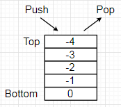

# Память в С++
### Кеш, оперативная память, стек и куча, выделение и освобождение памяти
---

#### Процессор


#### Важные константы
```
1 такт = 1 / частота процессора
1 / 3 GHz = 0.3 ns
                                             0.3 ns
L1 cache reference                           0.5 ns
Branch mispredict                            5   ns
```
> Неудачный if ()
```
L2 cache reference                           7   ns
Mutex lock/unlock                           25   ns
Main memory reference                      100   ns
```
> Кроме задержки (latency) есть понятие пропускной способности (throughput, bandwidth). В случае чтения из RAM - 10-50 Gb/sec
```
Compress 1K bytes with Zippy             3,000   ns
Send 1K bytes over 1 Gbps network       10,000   ns
Read 4K randomly from SSD              150,000   ns
Read 1 MB sequentially from memory     250,000   ns
Round trip within same datacenter      500,000   ns
Read 1 MB sequentially from SSD      1,000,000   ns
HDD seek                            10,000,000   ns
Read 1 MB sequentially from HDD     20,000,000   ns
Send packet CA->Netherlands->CA    150,000,000   ns
```
Источник: [https://gist.github.com/jboner/2841832](https://gist.github.com/jboner/2841832)

### Классы управления памятью и областью видимости в C++
Характеризуются тремя понятиями:
1. **Время жизни**
> Продолжительность хранения данных в памяти
2. **Область видимости**
> Части кода из которых можно получить доступ к данным
3. **Связывание (linkage)**
> Если к данным можно обратиться из другой единицы трансляции — связывание внешнее (external), иначе связывание внутреннее (internal)

#### Автоматический/регистровый (register)

| Время жизни | Область видимости | Связывание |
| --- | --- | --- |
| Автоматическое (блок) | Блок | Отсутствует |

```c++
{
	int i = 5;
}

if (true)
{
	register int j = 3;
}

for (int k = 0; k < 7; ++k)
{
}
```

#### Статический без связывания

| Время жизни | Область видимости | Связывание |
| --- | --- | --- |
| Статическое | Блок | Отсутствует |

```c++
void foo()
{
	static int j = 3;
}
```

> Инициализируется при первом обращении

#### Статический с внутренним связыванием

| Время жизни | Область видимости | Связывание |
| --- | --- | --- |
| Статическое | Файл | Внутреннее |

```c++
static int i = 5;
```

> Инициализируется до входа в main

#### Статический с внешним связыванием

| Время жизни | Область видимости | Связывание |
| --- | --- | --- |
| Статическое | Файл | Внешнее |

```c++
// *.cpp
int i = 0;
```
```c++
// *.h
extern int i;
```

### Типы памяти

#### Стек (Stack)


```c++
int i = 5;
std::string name;
char data[5];
```

#### Куча (Heap)

```c++
int* i = (int*) malloc(sizeof(int));
std::string* name = new std::string();
char* data = new char[5];
...
free(i);
delete(name);
delete[] data;
```

#### Data segment

```c++
static const int i = 5;
static std::string name;
extern char data[5];
```

### Арифметика указателей
Указатель - адрес ячейки памяти.

sizeof - размер типа в байтах
> C++ не дает гарантий на точный размер int, long и т.д. В кроссплатформенном коде надо использовать int32_t, uint64_t и т.д.
```c++
int* i = ...;
++i;
```
Фактически:
```c++
ptr = (char*) i;
ptr = ptr + sizeof(int);
i = (int*) ptr;
```
```c++
i += 5;
```
Фактически:
```c++
ptr = (char*) i;
ptr = ptr + 5 * sizeof(int);
i = (int*) ptr;
```
> C-cast использовать в С++ нельзя! Как надо приводить типы в С++ и надо ли вообще будет в другой лекции

Для указателя ни на что не ссылающегося следует использовать nullptr

Разность указателей:
```c++
ptrdiff_t delta = ptr1 - ptr2;
```

### Массивы
```c++
int data[] = { 1, 2, 3 };
int i = data[2];
```
Фактически - это вычисление смещения:
```c++
ptr = data;
ptr = ptr + 2 * sizeof(int);
i = *ptr;
```
Массив - непрерывный блок байт в памяти, sizeof(data) вернет размер массива в байтах (не элементах!). Размер массива в элементах можно вычислить: sizeof(data) / sizeof(data[0])
```c++
int* data = new int[10];
int i = data[2];
delete[] data;
```

### Двумерные массивы
```c++
T array[maxRows][maxColumns];
T value = array[y][x];
```
```c++
int data[][] = { { 1, 2 },  { 3, 4 }, { 5, 6 } };
int i = data[2][1];
```
Фактически:
```c++
ptr = data;
ptr = ptr + maxColumns * sizeof(int) * 2 + 1;
i = *ptr;
```


